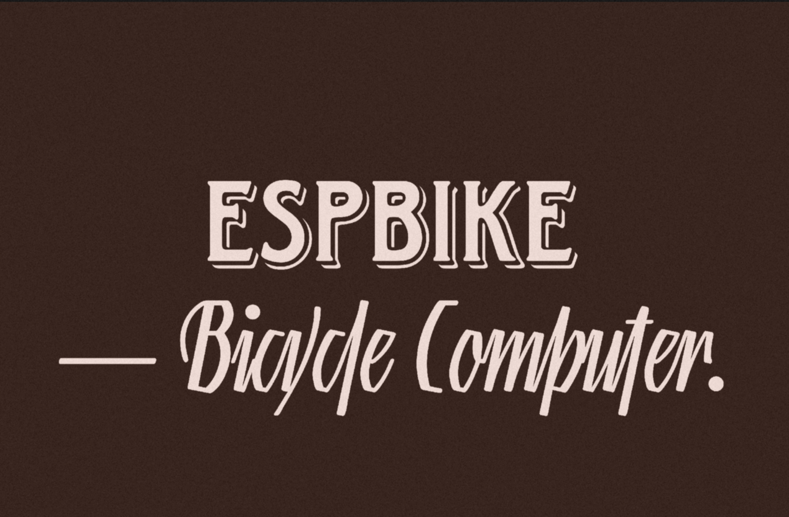

# 🚴⚡ ESPBike - [English](https://github.com/YaTvik/ESPBike/blob/main/README.md)
🚴 This is a bike computer based on the ESP32 microcontroller that displays speed and distance, assists the rider, and even suggests when to slow down!

# ESPBike — Велокомпьютер для велосипеда.

**Версия: 1.0 | Open Source (MIT) | На базе ESP32**

---

## 📋 О проекте

**ESPBike** — это мой первый публичный проект на базе микроконтроллера ESP32. Я собрал велокомпьютер, который показывает скорость, дистанцию, помогает следить за нагрузкой на колени, подсказывает оптимальный темп и даже определяет уклон дороги.

Проект полностью рабочий, проверен на практике. Весь код и схема подключения — в открытом доступе.

---

## 🚴 Что умеет велокомпьютер

### 📊 Основные показатели
- **Текущая скорость** — крупные цифры, видно даже в движении
- **Максимальная скорость** — за всю поездку
- **Средняя скорость** — честный расчёт без ошибок GPS
- **Автостоп** — если остановились на светофоре, таймер поездки приостанавливается

### 📏 Дистанция
- **Поездка** — сколько проехали за сегодня
- **Дневная дистанция** — обнуляется каждый день
- **Общая дистанция** — весь пробег с момента сборки

### ⏱️ Время
- **Время в движении** — без учёта остановок
- **Общее время** — с момента включения устройства
- **Часы** — отображаются на главном экране (берутся с GPS)

### 🦵 Нагрузка и здоровье
- **Нагрузка на колени** — моя собственная разработка. Анализирует скорость, пройденную дистанцию и уклон дороги
- **Шкала от зелёного до красного** — если стало красным, пора отдохнуть
- **Сигнал перегрузки** — при 100% нагрузке звучит 3-секундный сигнал, затем 3 минуты паузы, потом непрерывный сигнал до снижения нагрузки
- **Калории** — примерный расход энергии за поездку

### ⛰️ Уклон дороги
- **Отображение уклона в процентах** — показывает крутизну подъёма или спуска
- **Стрелки влево** — наглядная индикация: вверх (подъём), вниз (спуск), квадрат (ровно)
- **Калибровка** — автоматическая при старте, учитывает положение устройства
- **Предупреждение о резком изменении уклона** — звуковой сигнал, если уклон резко меняется

### 🎯 Режим PACER (темп)
- **Установите время и дистанцию** — велокомпьютер рассчитает нужную скорость
- **Подсказка по темпу** — показывает целевую скорость
- **Предупреждение** — если скорость отклоняется более чем на 5 км/ч, звучит сигнал
- **Расчёт ETA** — показывает примерное время прибытия
- **Поздравление** — при достижении цели звучит мелодия успеха

### 📳 Вибро-предупреждение
- **Анализ вибраций** — датчик MPU6050 отслеживает тряску
- **Предупреждение** — если вибрации превышают норму при скорости > 10 км/ч, звучит сигнал

### 🌡️ Погода
- **Температура** и **влажность** — от датчика DHT11

### 🌓 Авто-тема
- **Днём — светлая тема**, **ночью — тёмная** (по времени с GPS)
- **Блокировка темы** — если GPS потерян, тема остаётся прежней

---

## 🔧 Проверка при включении

Когда вы включаете устройство, оно **не просто показывает экран**. Сначала происходит автоматическая проверка всех модулей.

**Что проверяется:**

| Модуль | Что проверяется | Что если ошибка |
|--------|-----------------|-----------------|
| **TFT** | Экран, подсветка | Не включится — вы увидите пустой экран |
| **EEPROM** | Память для сохранения настроек | Перестанет запоминать общий пробег |
| **TOUCH** | Сенсорный экран | Кнопки не будут работать |
| **MPU6050** | Датчик движения | Не будет считаться уклон и нагрузка |
| **GPS** | Спутниковый модуль | Не будет скорости и дистанции |
| **BUZZER** | Зуммер | Не будет звуковых сигналов |
| **DHT11** | Датчик температуры | Не будет показывать погоду |

**Важно:** если какой-то модуль не инициализировался, устройство покажет ошибку и будет ждать 30 секунд. Вы можете **удерживать экран** (коснуться и держать) — это пропустит проверку и загрузится с неработающим модулем. Удобно, если вы тестируете сборку без всех датчиков.

---

## 🔋 Сколько работает

| Режим | Время работы |
|-------|--------------|
| От USB-зарядки | Бесконечно |
| От 18650 (2000 мАч) | ~15+ часов |

---

## 🛠️ Что нужно для сборки

### Основные детали

| Деталь | Зачем нужна | Примерная цена | Ссылки / Корзина |
|--------|-------------|----------------|------------------|
| **ESP32-WROOM** | Главный процессор | ~400 ₽ | https://ozon.ru/t/sX2Xuq5 |
| **TFT экран 2.8"** | Показывает данные | ~800 ₽ | https://ozon.ru/t/6lilXGP |
| **GPS модуль QUESCAN M10Q** | Измеряет скорость | ~1000 ₽ | https://ozon.ru/t/a8y8j0E |
| **MPU6050** | Датчик движения (уклон) | ~200 ₽ | https://ozon.ru/t/9ocoVb5 |
| **DHT11** | Температура/влажность | ~150 ₽ | https://ozon.ru/t/RhGhY2H |
| **Зуммер** | Звуковые сигналы | ~50 ₽ | https://ozon.ru/t/bTDTdHa |
| **Аккумулятор** | Автономное питание | ~200 ₽ | https://ozon.ru/t/LC3CNfX |
| **Отсек под аккумулятор** | Держатель батареи | ~80 ₽ | https://ozon.ru/t/9ocoVb5 |
| **Саморезы M2x10мм** | Крепеж, также можно купить в любом хозмаге | ~50 ₽ | — |
| **Корпус** | Самому печатать выйдет в рублей ~100 | ~50 ₽ | https://github.com/YaTvik/ESPBike/tree/main/3D_Models |
| **Дисплей батареи** | Необязательно, но тогда вы не увидите процент заряда | ~50 ₽ | https://ali.click/2iidj1l |
| **Переключатели** | Для включения/выключения устройства | ~40 ₽ ОПТОМ | https://ali.click/1iodj1y |
| **tp4056** | Плата заряда | ~100 ОПТОМ ₽ | https://ali.click/694ij1h |
| **Итого** | | **~3000 ₽** | Корзина: https://www.ozon.ru/cart?share=RhGhbio без саморезов, дисплея батареи и переключателей|

### Дополнительно
- Корпус: [можно напечатать на 3D-принтере](https://github.com/YaTvik/ESPBike/tree/main/3D_Models)

---

# 🔌 Подключение модулей к ESP32

---

## TFT дисплей (2.8" ILI9341)

| TFT | Пин ESP32 |
|-----|-----------|
| VCC | 3.3V |
| GND | GND |
| CS | GPIO5 |
| DC | GPIO2 |
| RST | GPIO4 |
| MOSI | GPIO23 |
| SCLK | GPIO18 |
| LED | 3.3V |

| Touch | Пин ESP32 |
|-------|-----------|
| VCC | 3.3V |
| GND | GND |
| T_CS | GPIO33 |
| T_MOSI | GPIO32 |
| T_MISO | GPIO34 |
| T_CLK | GPIO25 |
| T_IRQ | GPIO35 |

---

## GPS (QUESCAN M10Q)

| GPS | Пин ESP32 |
|-----|-----------|
| VCC | 3.3V |
| GND | GND |
| TX | GPIO16 |
| RX | GPIO17 |

---

## MPU6050

| MPU6050 | Пин ESP32 |
|---------|-----------|
| VCC | 3.3V |
| GND | GND |
| SDA | GPIO21 |
| SCL | GPIO22 |

---

## DHT11

| DHT11 | Пин ESP32 |
|-------|-----------|
| VCC | 3.3V |
| GND | GND |
| DATA | GPIO13 |

---

## Зуммер

| Зуммер | Пин ESP32 |
|--------|-----------|
| SIG | GPIO26 |
| GND | GND |

---

## TP4056

| TP4056 | Куда |
|--------|------|
| IN+ | USB 5V |
| IN- | USB GND |
| BAT+ | 18650 + |
| BAT- | 18650 - |

---

## Выключатель (3 пина)

| Выключатель | Куда |
|-------------|------|
| 1 (COM) | TP4056 OUT+ |
| 2 (NO) | ESP32 VIN |
| 3 (NC) | Не подключать |

---

## Индикатор заряда

| Индикатор | Куда |
|-----------|------|
| B+ | TP4056 BAT+ |
| B- | TP4056 BAT- |

---

## ⚙️ Как установить прошивку

### 1. Установите Arduino IDE
Скачайте и установите [Arduino IDE](https://www.arduino.cc/en/software)

### 2. Настройте Arduino IDE для ESP32
- Откройте **Файл → Настройки**
- В поле **Дополнительные ссылки для менеджера плат** добавьте: https://raw.githubusercontent.com/espressif/arduino-esp32/gh-pages/package_esp32_index.json

- Откройте **Инструменты → Плата → Менеджер плат**
- Найдите и установите **esp32** (автор Espressif Systems)

### 3. Установите библиотеки

**Самый простой способ — скачать готовый архив:**

1. Скачайте архив со всеми библиотеками:  
   👉 [ESPBike_Libs.zip](libs/ESPBike_library.zip)

2. Распакуйте содержимое в папку:  
   `Documents/Arduino/libraries/`

3. Перезапустите Arduino IDE

**Или установите вручную через менеджер библиотек:**

| Библиотека | Автор |
|------------|-------|
| **TFT_eSPI** | Bodmer |
| **SparkFun u-blox GNSS** | SparkFun |
| **XPT2046_Touchscreen** | Paul Stoffregen |
| **DHT sensor library** | Adafruit |

---

### 🔧 Настройка TFT_eSPI

**Важно!** После установки библиотеки TFT_eSPI нужно заменить один файл.
**Если вы скачали готовый архив** — файл уже заменён, можете пропустить этот шаг.

**Если вы устанавливали библиотеки вручную:**

1. Найдите папку: `Documents/Arduino/libraries/TFT_eSPI/`
2. Удалите файл `User_Setup.h`
3. Скопируйте сюда файл `User_Setup.h` из папки:  
   👉 [Settings TFT_eSPI/User_Setup.h](Settings%20TFT_eSPI/User_Setup.h)

📖 **Подробная инструкция:** [Открыть](Settings TFT_eSPI/Instructions)

---

### 4. Загрузите прошивку
- Скачайте файл `ESPBike.ino` из папки `firmware/`
- Откройте его в Arduino IDE
- Подключите ESP32 к компьютеру
- Выберите **Инструменты → Плата → ESP32 Dev Module**
- Выберите правильный **порт**
- Нажмите **Загрузить**
- Зажмите на плате кнопку "boot" для перехода платы в режим прошивки (Если плата вдруг не переходит в режим прошивки, то попробуйте перевести в режим прошивки принудительно, соединив пин GPIO0 на плате с пином GND с помощью обычной перемычки (куска провода))

### 5. Проверьте работу
После загрузки ESP32 перезагрузится и начнёт инициализацию. Если все датчики подключены правильно, вы увидите главный экран велокомпьютера.

---

## ❓ Частые вопросы

### ❓ Почему скорость показывает 0, хотя я еду?
**Ответ:** Посмотрите на число спутников в правом верхнем углу. Если там 0 — GPS не поймал сигнал. Выезжайте на открытое место, подождите минуту.

### ❓ Как работает автостоп?
**Ответ:** Если вы остановились, таймер поездки продолжает идти ещё 3 секунды, потом останавливается. Это помогает не сбрасывать время на коротких остановках.

### ❓ Почему не работает уклон?
**Ответ:** Проверьте, инициализировался ли MPU6050 при старте. Если нет — перезагрузите устройство. Убедитесь, что датчик подключён правильно.

### ❓ Как включить PACER?
**Ответ:** Нажмите зелёную кнопку PACER. Введите время (в минутах) и дистанцию (в километрах). Нажмите OK. Режим запустится.

### ❓ Можно ли использовать без GPS?
**Ответ:** Нет. GPS — единственный источник скорости. Без него велокомпьютер не работает.

### ❓ Как узнать общий пробег?
**Ответ:** На главном экране есть строка «Всего». Это общая дистанция с момента сборки. Она не обнуляется.

### ❓ Что делать, если экран не включается?
**Ответ:** Проверьте правильность подключения к микроконтроллеру.

---

## 🎯 Для кого этот проект

| Вы | Подойдёт ли ESPBike |
|---|---------------------|
| Хотите велокомпьютер, но не переплачивать | ✅ Да |
| Катаетесь по выходным | ✅ Да |
| Ездите на работу каждый день | ✅ Да |
| Хотите следить за нагрузкой | ✅ Да |
| Хотите контролировать темп на длинных дистанциях | ✅ Да |
| Учитесь программировать ESP32 | ✅ Да |
| Любите делать вещи своими руками | ✅ Да |

---

## 🤝 Как помочь проекту

Это мой первый проект, поэтому любая помощь важна:

- **Расскажите о нём** другим велосипедистам и радиолюбителям
- **Сообщайте об ошибках** — если что-то работает не так
- **Предлагайте идеи** — что можно улучшить
- **Показывайте свои сборки** — мне интересно посмотреть
- **Ставьте ⭐** — это помогает проекту расти

---

## 📄 Лицензия

### Код (прошивка) — MIT License
Код распространяется под лицензией MIT. Вы можете свободно использовать, изменять и распространять код.

### Железо (корпус, схема) — Проприетарное
Корпус, 3D-модели и схема подключения являются моей интеллектуальной собственностью. Вы можете использовать их для личного некоммерческого использования. Коммерческое использование (включая продажу устройств на основе моей схемы или корпуса) запрещено без моего письменного разрешения.

### Бренд
Название "ESPBike" является моим товарным знаком. Никто не может продавать устройства под этим названием без моего разрешения.

---

## 📬 Контакты

По вопросам коммерческого использования, лицензирования или сотрудничества:

- 📧 Email: mcvictorok@gmail.com
- 💬 GitHub Issues: [Создать обращение](https://github.com/YaTvik/ESPBike/issues)

---

## 🌟 Поставьте звезду!

Если проект вам полезен — поставьте ⭐ на GitHub. Это помогает другим находить его.

---

**Сделано с ❤️ для велосипедистов и тех, кто учится.**

*Это мой первый проект, и я очень рад, что вы его посмотрели. Катайтесь с удовольствием, берегите колени и не бойтесь собирать свои устройства!* 🚴‍♂️

---

## 📝 Примечание об использовании ИИ

При создании этой прошивки я использовал ChatGPT. Я считаю, что это нормально — учиться с помощью современных инструментов.
